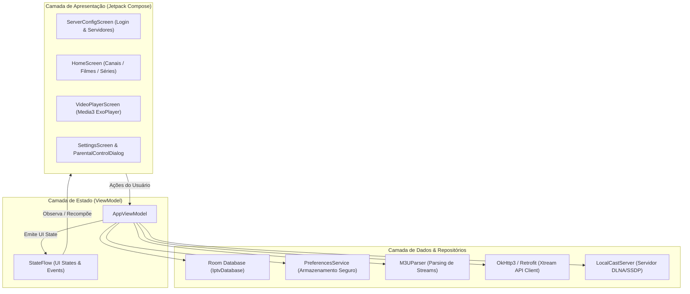

# BGs Streaming (MK21 MultiServidor)

<div align="center">
  
  
  ### Media Center & IPTV Client Avançado para Android e Android TV
  
  [](https://developer.android.com)
  [](https://kotlinlang.org)
  [](https://developer.android.com/jetpack/compose)
  [](https://developer.android.com/guide/topics/media/media3)
  [](https://developer.android.com/training/data-storage/room)
</div>

---

## 📌 Visão Geral

O **BGs Streaming** é uma solução completa de reprodução multimídia e gerenciamento de listas IPTV, VOD e Séries para dispositivos Android (Smartphones, Tablets e Android TV / TV Box). Construído 100% com **Jetpack Compose** e arquitetura moderna, o aplicativo oferece sincronização de múltiplos servidores, reprodução de alta performance via **AndroidX Media3 ExoPlayer**, casting local via DLNA/UPnP, suporte a listas M3U/Xtream Codes e controle parental com PIN de segurança.

---

## 🚀 Funcionalidades Principais

- 📺 **Multi-Servidor Inteligente**: Alternância contínua entre múltiplos provedores pré-configurados e suporte a listas manuais personalizadas.
- ⚡ **Player de Alta Performance**: Motor baseado no Media3 ExoPlayer com suporte nativo a HLS (`.m3u8`), MPEG-TS (`.ts`) e MP4, controle de proporção de tela, seleção de faixas de áudio e legendas.
- 📱 **Interface Adaptativa**: Layout responsivo otimizado para celulares (orientação vertical e horizontal) e compatibilidade com navegação D-Pad em Android TV.
- 💾 **Persistência Offline**: Cache local e indexação veloz de milhares de canais, filmes e séries utilizando Room Database SQLite com transações em lotes (*chunking*).
- 📡 **DLNA & Local Streaming Cast**: Servidor HTTP local integrado para espelhamento e controle remoto para Smart TVs na rede Wi-Fi local.
- 🔒 **Controle Parental**: Bloqueio por PIN para categorias de conteúdo adulto com verificação biométrica e timeout de sessão.
- 🎨 **Material 3 Theming**: Design escuro dinâmico (modo AMOLED), cartões com elevação visual, badges de qualidade e navegação fluida.

---

## 🏗️ Arquitetura do Sistema

O aplicativo segue o padrão arquitetural **MVVM (Model-View-ViewModel)** com fluxo de dados unidirecional (**UDF - Unidirectional Data Flow**) baseado em Kotlin Coroutines e StateFlow.

### Diagrama de Camadas



### Componentes Principais

| Módulo / Classe | Responsabilidade |
| :--- | :--- |
| `MainActivity.kt` | Ponto de entrada, configuração edge-to-edge, insets e gerenciamento do ciclo de vida |
| `AppViewModel.kt` | Orquestração do estado global, regras de negócio, carregamento de listas e autenticação |
| `Screens.kt` | Telas composables, componentes de interface, dialogs e renderização do ExoPlayer |
| `IptvDatabase.kt` | Definição do banco Room, DAOs (`PlaylistItemDao`, `ManualPlaylistDao`) e queries otimizadas |
| `PreferencesService.kt` | Gestão de configurações locais, credenciais ativas e preferências do usuário |
| `M3UParser.kt` | Motor de processamento concorrente para grandes listas no formato `#EXTM3U` |
| `LocalCastServer.kt` | Servidor socket HTTP e discovery SSDP para transmissão DLNA na rede local |

---

## 🛠️ Tecnologias e Dependências

- **Linguagem**: Kotlin 2.1.10
- **UI Toolkit**: Jetpack Compose (BOM 2024.09.00) + Material Design 3
- **Reprodução de Vídeo**: AndroidX Media3 ExoPlayer 1.4.1 (HLS, DASH, Core, UI)
- **Persistência**: AndroidX Room 2.7.0 (Kotlin KSP)
- **Rede & HTTP**: OkHttp 4.10.0, Retrofit 2.12.0, Moshi Kotlin 1.15.2
- **Carregamento de Imagens**: Coil Compose 2.7.0
- **Concorrência**: Kotlin Coroutines 1.10.2 & Flow
- **Segurança**: AndroidX Security Crypto & Android KeyStore
- **Testes**: JUnit 4, Robolectric 4.16.1, Roborazzi Screenshot Testing

---

## ⚙️ Instruções de Setup & Build Local

### Pré-requisitos
- **Android Studio Ladybug (ou superior)**
- **JDK 17** (OpenJDK ou Temurin)
- **Android SDK API 36** instalado

### Passo a Passo

1. **Clone o repositório:**
   ```bash
   git clone https://github.com/2fbg/BGs-Streaming.git
   cd BGs-Streaming
   ```

2. **Configure o arquivo de ambiente `.env`:**
   Copie o modelo de variáveis de ambiente:
   ```bash
   cp .env.example .env
   ```
   Edite as variáveis de ambiente necessárias:
   - `STORE_PASSWORD` e `KEY_PASSWORD`: Senhas para assinatura de Release do APK/AAB.
   - `LICENSE_SECRET`: Segredo HMAC-SHA256 para validação de licença.
   - `GEMINI_API_KEY`: Chave de API opcional para recursos de IA.

3. **Gere a Keystore de desenvolvimento (se necessário):**
   O projeto inclui geração automática da keystore de debug ao executar o Gradle.

4. **Compilar e executar o projeto:**
   ```bash
   # Compilação da versão Debug
   gradle assembleDebug

   # Execução dos testes unitários e Robolectric
   gradle testDebugUnitTest
   ```

---

## 🔐 Recomendações de Segurança e Boas Práticas

Para ambientes de produção ou distribuição no Google Play:

1. **Não versione Keystores ou senhas no Git**: Mantenha arquivos `.jks`, `.keystore` e `.base64` estritamente no `.gitignore`. Utilize as variáveis de ambiente `STORE_PASSWORD`, `KEY_PASSWORD` e GitHub Secrets no pipeline de CI/CD.
2. **Armazenamento Criptografado**: Utilize `EncryptedSharedPreferences` com chaves geradas dinamicamente no hardware seguro (**Android KeyStore / StrongBox**).
3. **Comunicação Segura**: Configure uma `Network Security Config` restritiva para forçar HTTPS sempre que suportado pelo provedor de streaming.

---

## 📄 Licença

Este projeto é desenvolvido para fins educacionais e de demonstração multimídia. Todos os direitos reservados aos respectivos autores.
